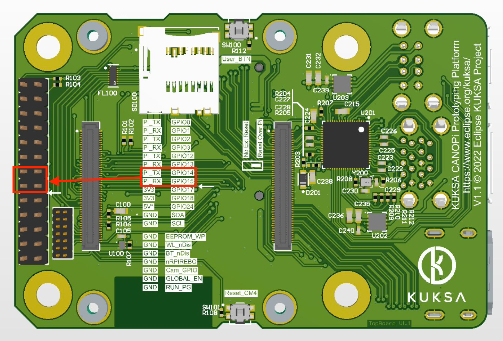

# Enabling Hardware support in your OS

To be able to make use of all hardware on CANOPi you need to configure your Linux distribution accordingly.

This guide assumes you are using a current (as of 2022) Raspberry Pi OS version based on Debian Bullseye.

The instructions should work on other distributions that also follow the Raspberry OS boot procedure providing a similarly recent kernel.

Before booting the first time the OS on the device, you have to modify the `config.txt` file on the boot partition to extend the device tree. The device tree is the structure that tells the Linux kernel which hardware is available. As the boot partition is a FAT partition you can make these modifications easily even on Windows or OS X after [flashing the operating system](https://www.raspberrypi.com/software/), before booting the first time

## General settings
Make sure you have the following entries in you `config.txt`

```
enable_uart=1
dtoverlay=dwc2,dr_mode=host
```

also edit `cmdline.txt` and **remove** the entry `console=serial0,115200`

## CAN FD controllers
CANOPi has two CAN FD controllers connected via SPI. To enable than uncomment/add the following lines in `config.txt`

```
dtparam=spi=on
dtoverlay=mcp251xfd,spi0-0,interrupt=27,oscillator=20000000
dtoverlay=mcp251xfd,spi0-1,interrupt=22,oscillator=20000000
```

After reboot check, if the `can0` and `can1` interfaces are available, i.e. using

```
ifconfig -a
````

or

```
dmesg | grep spi
```

To learn how to configure the interfaces check [here](https://python-can.readthedocs.io/en/master/interfaces/socketcan.html) or [here](https://www.kernel.org/doc/html/latest/networking/can.html) for more in-depth information


## STN2120 OBD controller

Fit jumpers between GPIO15 and PI_RX and GPIO14 and PI_TX.

You can find the headers on the top board, see the following picture for reference




Double check you **removed**  `console=serial0,115200` from `cmdline.txt` and boot CANOPi.


In default configuration the OBD chip uses 9600 baud. You can connect using screen like this

```
screen /dev/ttyS0 9600 81N
```

When you enter `STI` the OBD IC should answer with its firmware version.

To enable wakeup trigger send `STSLVG ON`, then you can send the chip to sleep by sending `STSLEEP`.

This sets the chip into sleep mode. The LED STAT turns into burst mode (only emits short bursts of light and stays off most of the time). A push on the WAKE_STN button should wake the chip back up.

For more information on the supported commands check [general information](https://www.obdsol.com/solutions/chips/stn2120/) and the [programming manual](https://www.scantool.net/scantool/downloads/98/stn11xx21xx_frpm-c.pdf).

If you want to use the OBD port, we recommend increasing the default baudrate. See the programming manual for details. You can also (mis)-use the OBD connection as general CAN sniffer, but there are performance limitations. See the [KUKSA.val DBC feeder documentation](https://github.com/eclipse/kuksa.val/tree/master/kuksa_feeders/dbc2val#elmobdlink-support) for details. Generally we recommend using the real CAN ports for CAN access, and use the STN2120 for OBD access only.

## Realtime Clock
CANOPi contains an RTC, which means the board can keep time even when powered of. This is important because most cryptographic protocols break if a system comes back with a wrong time.

To use the RTC uncomment/add the following lines to `config.txt`

```
dtparam=i2c_vc=on
dtoverlay=i2c-rtc,pcf85063a,i2c_csi_dsi,addr=0x51
```

Reboot and type

```
dmesg | grep rtc
```

 to see whether the clock has been detected and

```
sudo hwclock
```

to show the system clock.


## Camera

To enable the camera port you need to download https://datasheets.raspberrypi.com/cmio/dt-blob-cam1.bin and rename it to `dt-blob.bin` and put it into your /boot partition.

If you have already booted the OS you can achieve it by typing

```
sudo wget https://datasheets.raspberrypi.com/cmio/dt-blob-cam1.bin -O /boot/dt-blob.bin
```

Make sure you uncomment/add the following lines to `config.txt`

```
dtoverlay=vc4-kms-v3d
camera_auto_detect=1
```

And then reboot. Check the [Raspberry camera documentation](https://www.raspberrypi.com/documentation/accessories/camera.html) for further information.


## Enable Cellular card
If you fitted a cellular modem to the M2 slot, you need to enable the card first

On the CANOPi type

```
sudo -i
echo "16" > /sys/class/gpio/export
echo "out" > /sys/class/gpio/gpio16/direction
echo "1" >/sys/class/gpio/gpio16/value
```
This creates a handle for GPIO pin 16, declares it as output and sets it to HIGH. GPIO pin 16 carries a signal called "Full Card Power OFF LTE" which, set to HIGH, turns on the LTE module. After a couple of seconds the module has started. Also, a red WWAN LED turns on.

You should be able to see the card on the USB bus by typing

```
lsusb
```

This shoudl work with any Linux supported cellular card. We had success with a [Sierra Wireless EM7455](https://www.sierrawireless.com/iot-solutions/products/em7455/).

## Fan control
The CANOPi dongle offers a dedicated switchable power connection to operate a fan. The connection can be configured to supply either the input voltage (typically 12V) or a 5V voltage at a maximum current of 115mA (default is 5V). 

To change the voltage, move Jumper JP600 (on the back side) from position 1-3 (5V) to position 1-2 (VIN). The combinations are also indicated on the silk screen.

The fan is connected to Pins 1 and 2 on the JP601 header. If unsure about the jumper setting, measure voltage across this pins first, before connecting fan.


Type

```
sudo -i
echo "25" > /sys/class/gpio/export
echo "out" > /sys/class/gpio/gpio25/direction
```

To establish an output port at GPIO pin 25. Internally this pin 25 is connected to operate the switchable power connection.

To switch the fan on

```
echo "1" >/sys/class/gpio/gpio25/value
```

To switch it off

```
echo "0" >/sys/class/gpio/gpio25/value
```
