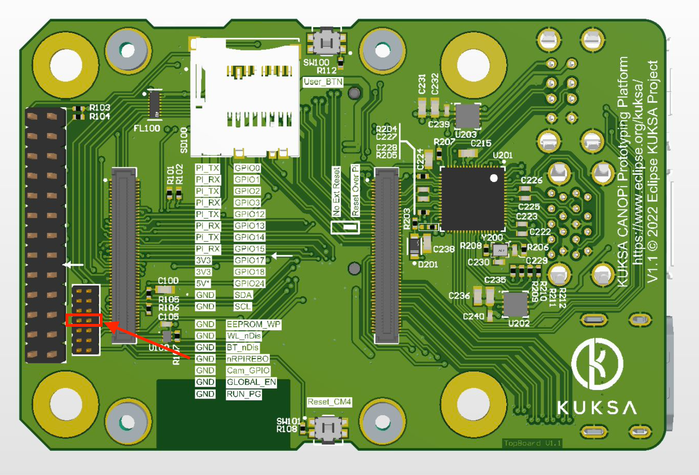

# Updating CM4 EEPROM

The CANOPi contains a VIA VL805 4 Port USB controller, just like a "normal" Raspbbery Pi 4. This USB controller needs some firmware loaded up during system initialization, before Linux boots.

As a vanilla CM4 does not contain this USB controller, it will not do that. Therefore we need to update the EEPROM on board the CM4. Normally you only need to do this once for any new CM4, the changes will survice reinstalling or changing the operating system, as long as you do not update the EEPROM again.

The procedure desrcribed here involves a second Raspberry Pi (any will do) with a second SD-card.

## Step-by-step guide
[Prepare two SD-cards](https://www.raspberrypi.com/software/) with the most recent version of Raspberry Pi OS (at least the release of Oct 5th 2021).
One card is designated to be used for the CM4 in the CANOPi OBD dongle. Insert the _first_ card into a Raspberry Pi (any Pi will do - there, you have support for keyboard and mouse) and type

```
sudo nano /boot/config.txt
```

And add the following lines

```
enable_uart=1
dtoverlay=dwc2,dr_mode=host
````

Press Ctrl-X to leave the editor and choose to save your changes.

Then type

```
sudo nano /etc/default/rpi-eeprom-update
```

And change it to include these lines

```
FIRMWARE_RELEASE_STATUS="stable"
CM4_ENABLE_RPI_EEPROM_UPDATE=1
```

Again, press Ctrl-X and choose to save cahnges.

Now, insert this SD card into the CANOPi dongle. That is, the _first_ SD card now moved from the Pi to the CANOPi. Put the CANOPi to the side. We will need it later.


Proceed to the _second_ SD card and insert it into the Raspberry Pi and boot it.

Make sure the Pi has Internet access and type

```
sudo apt install git libusb-1.0-0-dev build-essential
```

Next install usbboot

```
git clone --depth=1 https://github.com/raspberrypi/usbboot
cd usbboot
make
```

Remove the pieeprom.original and replace with the one to flash. Navigate to and remove the original file by typing

```
cd ~/usbboot/recovery
rm -f pieeprom.original.bin
```

Download a new file with

```
curl -L -o pieeprom.original.bin https://github.com/raspberrypi/rpi-eeprom/raw/master/firmware/stable/pieeprom-2021-12-02.bin
```

Edit the **boot.conf** file to support the VL805 USB controller and configure proper poweroff behavior for CANOPi. Therefore, type

```
sudo nano ~/usbboot/recovery/boot.conf
```

And modify it to include the following lines

```
WAKE_ON_GPIO=0
POWER_OFF_ON_HALT=1

VL805=1
```

Press Ctrl-X and save.

Now update pieeprom.bin with the configuration in `boot.conf` by typing (still in `~/usbboot/recovery/`)

```
sudo ./update-pieeprom.sh
```

Now  prepare to flash the target by typing

```
cd ~/usbboot
sudo ./rpiboot -d recovery
```

Live the Pi. Now turn you attention back to the CANOPi.
Fit a jumper on `nRPIREBO` and `GND`. You can find the pin header on the top board. see the following picture for reference



Fit a CM4. If you have followed this fine manual, the _first_ SD card is still inserted.

Now, connect one USB port from the Raspberry Pi to the microUSB port of the CANOPi dongle. Power on the CANOPi dongle and the flash process should initiate.  A regular blinking pattern of the green LED or, in case a screen is connected, an entirely green screen indicates a finished and successful flash procedure.

Now, power off CANOPi dongle, remove the jumper and power the board back on. The CANOPi dongle should boot normally and, once the CM4 is started, USB devices should be fully supported by the dongle.


